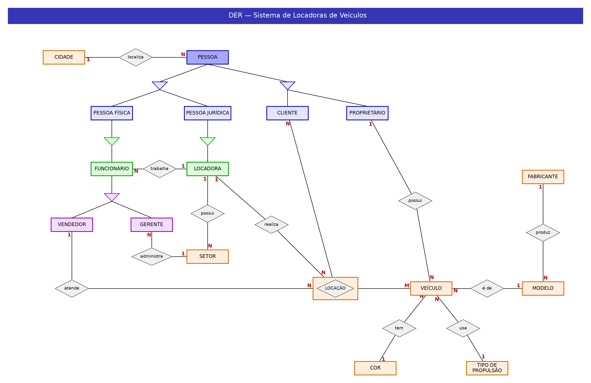
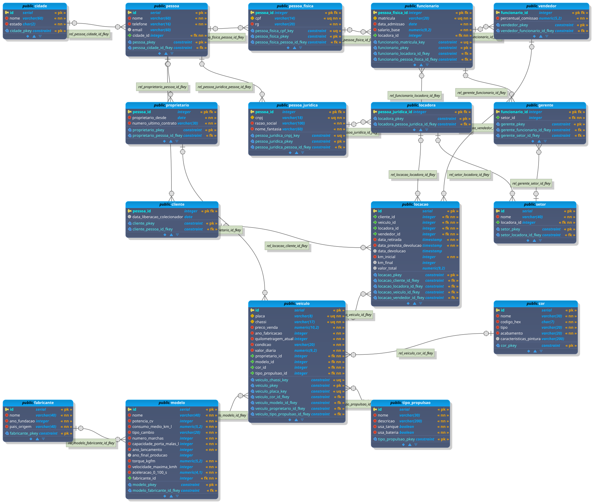

# Sistema de Administração de Locadoras de Veículos

Exercício de Modelagem de Dados (Banco de Dados I): modelo conceitual (DER), projeto relacional e script SQL para uma rede de locadoras de veículos, a partir da narrativa em `00Locadora__Carros__ModelagemDados__Exercicio.pdf` e das dicas em `01Locadora__Carros__ModelagemDados__DicasComplementares.pdf`.

## Arquivos

| Arquivo | Conteúdo |
|---|---|
| `der_conceitual.png` | DER conceitual (entidades, relacionamentos, especializações e cardinalidades) |
| `projeto_relacional.png` | Projeto relacional (tabelas, chaves primárias e estrangeiras) |
| `locadora.dbm` | Modelo do projeto relacional para abrir no pgModeler |
| `locadora.sql` | Script de criação das tabelas (`CREATE TABLE`) |
| `seeders.sql` | Dados de exemplo (`INSERT`) |
| `consultas.sql` | Consultas de exemplo (`SELECT`) |

## Como executar

Requer PostgreSQL com um banco chamado `locadora`:

```bash
createdb -U postgres locadora              # apenas na primeira vez
psql -U postgres -f locadora.sql           # cria as tabelas (apaga as existentes)
psql -U postgres -f seeders.sql            # insere os dados de exemplo
psql -U postgres -f consultas.sql          # executa as consultas
```

O `seeders.sql` deve ser executado depois do `locadora.sql`, pois este recria as tabelas vazias.

## Modelo



### Pessoas e papéis

- **Pessoa** guarda os dados comuns a indivíduos e organizações: nome, telefone, e-mail e cidade.
- **Pessoa Física** (CPF, RG) e **Pessoa Jurídica** (CNPJ, razão social, nome fantasia) são especializações de Pessoa.
- **Locadora** é uma especialização de Pessoa Jurídica.
- **Proprietário** (desde quando, número do último contrato) e **Cliente** (data de liberação para carros de colecionador) são papéis de Pessoa. Uma mesma pessoa, física ou jurídica, pode ter os dois papéis sem repetir seus dados.
- **Funcionário** (matrícula, data de admissão, salário base) é uma especialização de Pessoa Física e trabalha para uma única Locadora.
- **Vendedor** (percentual de comissão) e **Gerente** são especializações de Funcionário. Cada gerente administra um único **Setor**, e um setor pode ter vários gerentes.

### Veículos

- **Veículo**: placa, chassi, preço de venda, ano de fabricação, quilometragem atual, condição e valor atual da diária. Cada veículo tem um único proprietário.
- **Modelo** guarda as características técnicas e pertence a um **Fabricante**.
- **Cor** e **Tipo de Propulsão** são entidades próprias, ligadas ao veículo.

### Locações

**Locação** resolve o relacionamento N para N entre Cliente e Veículo. Cada locação registra o cliente, o veículo, a locadora e o vendedor responsável, as datas de retirada, de devolução prevista e de devolução efetiva, a quilometragem inicial e final e o valor total cobrado.

## Decisões de modelagem

- **Cidade é uma entidade** (nome e estado), referenciada por Pessoa, porque uma cidade está associada a muitas pessoas e organizações.
- **Proprietário e Cliente referenciam Pessoa**, e não Pessoa Física ou Jurídica, porque tanto indivíduos quanto organizações podem possuir veículos e realizar locações.
- **Funcionário referencia Pessoa Física**, porque somente indivíduos têm matrícula, CPF e RG.
- **O nome fica em Pessoa** porque a narrativa exige nome para todos os clientes. Para organizações, ele funciona como nome de exibição.
- **O valor da diária fica em Veículo**, sem histórico, como pede a narrativa. O **valor total fica em Locação**, preenchido ao final da operação.
- **Setor pertence a uma Locadora**, já que a narrativa fala em "setores das locadoras".
- **Os campos preenchidos só na devolução** (data de devolução, km final e valor total) aceitam nulo, permitindo registrar locações em andamento.
- **A condição do veículo** é um texto com os valores Excelente, Muito bom, Bom, Regular ou de Colecionador.

## Projeto relacional



Para editar o projeto relacional, abra o `locadora.dbm` no pgModeler (**File > Open**).
